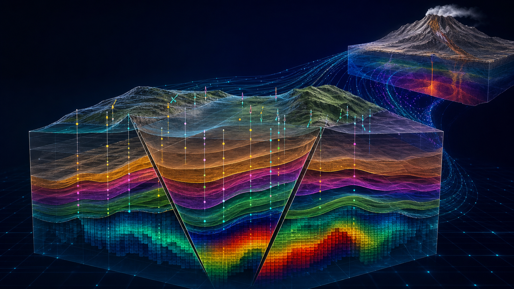
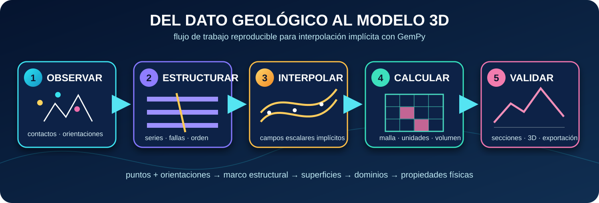
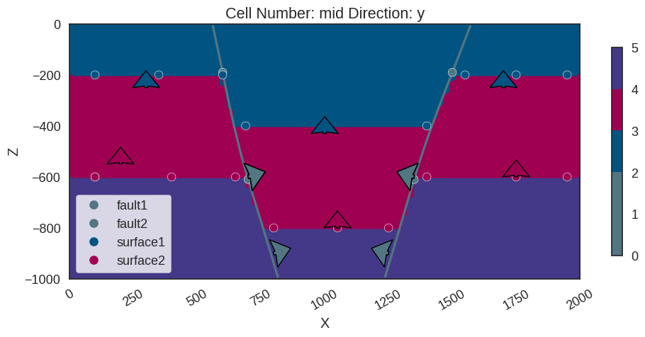
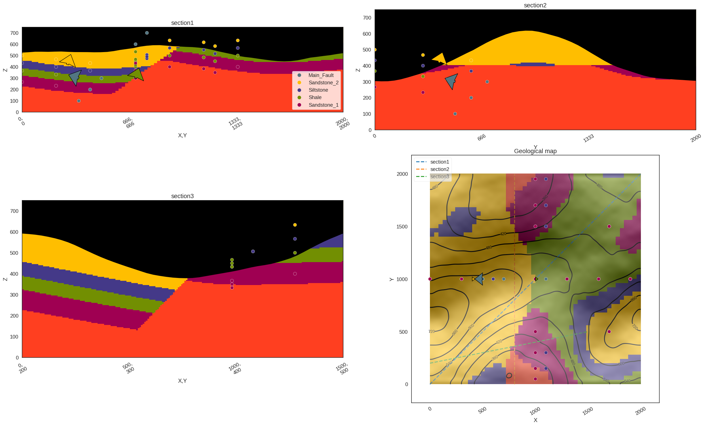
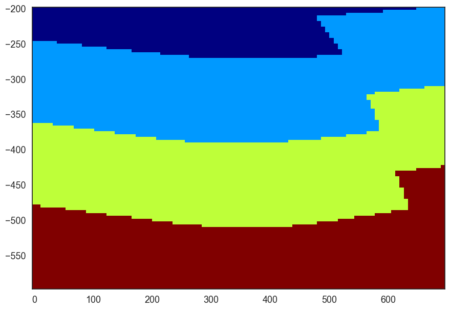
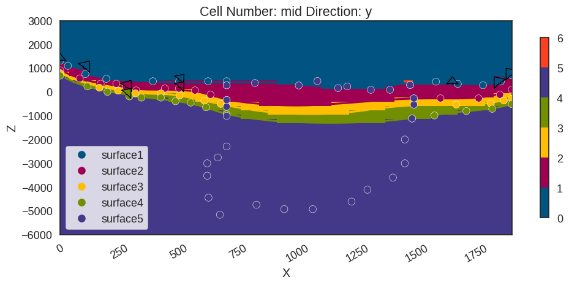

<div align="center">

# GemPy Modeling

### Modelado geológico implícito 3D, estructuras, perfiles y conexión con modelado sísmico

[](https://www.python.org/)
[](https://www.gempy.org/)
[](https://jupyter.org/)
[](https://pyvista.org/)

**De observaciones geológicas dispersas a modelos estructurales continuos y propiedades físicas listas para simulación.**

</div>



## Visión general

Este repositorio reúne el material práctico del **curso de GemPy de la XVI Semana Técnica de Geología, Ingeniería Geológica y Geociencias** (Bucaramanga, 2024). Los ejemplos recorren una progresión científica completa: definición manual de superficies, lectura de datos estructurales desde CSV, construcción de fallas y grabens, extracción de perfiles, modelado del sistema del Cerro Machín y transformación de unidades geológicas en un modelo de velocidades para aplicaciones sísmicas.

GemPy utiliza **interpolación implícita** para reconstruir superficies y dominios geológicos a partir de dos familias principales de observaciones:

- **Puntos de superficie:** posiciones `X, Y, Z` que pertenecen a una interfaz geológica.
- **Orientaciones:** azimut, buzamiento y polaridad que controlan la geometría local de la interfaz.

El resultado es un modelo volumétrico coherente con la pila estratigráfica, las relaciones estructurales y las fallas declaradas por el usuario.

## Metodología



1. **Observar:** organizar contactos, orientaciones, sondeos y topografía.
2. **Estructurar:** definir elementos, grupos, orden estratigráfico y relaciones de falla.
3. **Interpolar:** construir campos escalares y superficies geológicas implícitas.
4. **Calcular:** evaluar el modelo sobre una malla regular y asignar unidades a cada celda.
5. **Validar y exportar:** revisar secciones y vistas 3D; derivar propiedades para otros simuladores.

## Recorrido por los archivos

| Módulo | Archivos | Qué hace | Resultado principal |
|---|---|---|---|
| **1 · Graben desde cero** | [`GrabenModel.ipynb`](1_grabenScratch/GrabenModel.ipynb) | Construye superficies y orientaciones manualmente, incorpora dos fallas normales y configura sus relaciones estructurales. | Sección de un graben y serialización opcional del modelo con `pickle`. |
| **2 · Graben desde CSV** | [`Graben_csv.ipynb`](2_graben_csv/Graben_csv.ipynb), [`Puntos.csv`](2_graben_csv/Puntos.csv), [`Orientaciones.csv`](2_graben_csv/Orientaciones.csv) | Reproduce el graben mediante tablas de contactos y orientaciones; separa los datos de entrada del código de modelado. | Flujo reproducible y reutilizable para cargar observaciones propias. |
| **3 · Perfiles geológicos** | [`ch1_3b_cross_sections.ipynb`](3_ejercicio_perfiles/ch1_3b_cross_sections.ipynb), [`points.csv`](3_ejercicio_perfiles/simple_fault_model_points.csv), [`orientations.csv`](3_ejercicio_perfiles/simple_fault_model_orientations.csv) | Agrega secciones arbitrarias, topografía y una falla principal a un modelo estratificado. | Mapa geológico y tres cortes para validar continuidad y desplazamiento. |
| **3.0 · GemPy → sísmica** | [`gempy2seismicmodeling.ipynb`](3_0_ejercicio_points/gempy2seismicmodeling.ipynb), [`wells.png`](3_0_ejercicio_points/wells.png), [`vmodel_gempy.npy`](3_0_ejercicio_points/vmodel_gempy.npy) | Construye un modelo desde información de pozos y convierte los identificadores litológicos en velocidades. | Matriz de velocidades `100 × 100`, `float64`, con rango de `1000–4100`. |
| **4 · Cerro Machín** | [`CerroMachinModel.ipynb`](4_cerroMachinModel/CerroMachinModel.ipynb), [`b-b.png`](4_cerroMachinModel/b-b.png) | Desarrolla progresivamente cinco superficies y sus orientaciones para representar la geometría del sistema volcánico. | Modelo estratigráfico de mayor complejidad y control visual por secciones. |

> Los archivos `.p` generados mediante `pickle` no se incluyen en el repositorio; se crean al ejecutar las celdas de exportación correspondientes.

## Resultados representativos

### 1. Geometría estructural de un graben

Las dos fallas normales limitan el bloque central hundido. Los puntos y vectores de orientación permiten inspeccionar qué observaciones controlan cada interfaz.



### 2. Validación mediante perfiles y mapa geológico

Las secciones permiten comparar la arquitectura interna del modelo a lo largo de distintas direcciones y detectar discontinuidades o relaciones estratigráficas inconsistentes.



### 3. Del modelo geológico al modelo de velocidades

Las unidades interpoladas se convierten en propiedades físicas discretas. El archivo `vmodel_gempy.npy` constituye un puente directo hacia modelado de propagación de ondas y experimentos sísmicos.

<p align="center">
  
</p>

### 4. Construcción progresiva del modelo del Cerro Machín

El ejemplo incorpora contactos y orientaciones a distintas escalas para controlar cinco superficies dentro de un dominio de aproximadamente 2 km de extensión horizontal y 6 km de profundidad.



## Inicio rápido

### Opción A · Conda

```bash
git clone https://github.com/Anagabrielamantilla/GempyModeling.git
cd GempyModeling
conda env create -f environment.yml
conda activate gempy2024
jupyter notebook
```

### Opción B · `venv` + pip

```bash
git clone https://github.com/Anagabrielamantilla/GempyModeling.git
cd GempyModeling
python3.12 -m venv .venv
source .venv/bin/activate
python -m pip install --upgrade pip
python -m pip install -r requirements.txt
jupyter notebook
```

> Para visualización 3D interactiva, ejecuta los notebooks en un entorno local con soporte gráfico. PyVista/VTK puede requerir configuración adicional en servidores sin pantalla.

## Orden recomendado

```text
1_grabenScratch
      ↓
2_graben_csv
      ↓
3_ejercicio_perfiles
      ↓
3_0_ejercicio_points  ──→  vmodel_gempy.npy  ──→  modelado sísmico
      ↓
4_cerroMachinModel
```

## Estructura del repositorio

```text
GempyModeling/
├── 1_grabenScratch/
│   └── GrabenModel.ipynb
├── 2_graben_csv/
│   ├── Graben_csv.ipynb
│   ├── Orientaciones.csv
│   └── Puntos.csv
├── 3_ejercicio_perfiles/
│   ├── ch1_3b_cross_sections.ipynb
│   ├── simple_fault_model_orientations.csv
│   └── simple_fault_model_points.csv
├── 3_0_ejercicio_points/
│   ├── gempy2seismicmodeling.ipynb
│   ├── vmodel_gempy.npy
│   └── wells.png
├── 4_cerroMachinModel/
│   ├── CerroMachinModel.ipynb
│   └── b-b.png
├── docs/assets/
├── environment.yml
└── requirements.txt
```

## Consideraciones de reproducibilidad

- El material original recomienda **Python 3.12.4**.
- Los notebooks utilizan las APIs modernas `gp.create_geomodel`, `gp.compute_model` y `gempy_viewer`; la versión de GemPy no estaba fijada en el material original, por lo que `requirements.txt` conserva una especificación compatible sin afirmar una versión histórica no registrada.
- Las figuras embebidas son resultados guardados en los notebooks y sirven como referencia; una ejecución nueva puede presentar variaciones visuales según las versiones de GemPy, GemPy Viewer, PyVista y VTK.
- Ejecuta cada notebook desde su propia carpeta para conservar las rutas relativas a CSV, PNG y NPY.

## Instructores

- **Ana Gabriela Mantilla**
- **Paul Goyes Peñafiel**

Material preparado para la **XVI Semana Técnica de Geología, Ingeniería Geológica y Geociencias**, Bucaramanga, 2024.

## Uso académico

Este repositorio se publica con fines educativos. No se declara una licencia abierta en el estado actual; antes de reutilizar o redistribuir los materiales, confirma los permisos correspondientes con sus autores.

---

<div align="center">

**Datos estructurales → interpolación implícita → modelo 3D → propiedades físicas**

</div>
